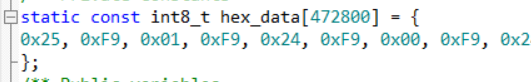
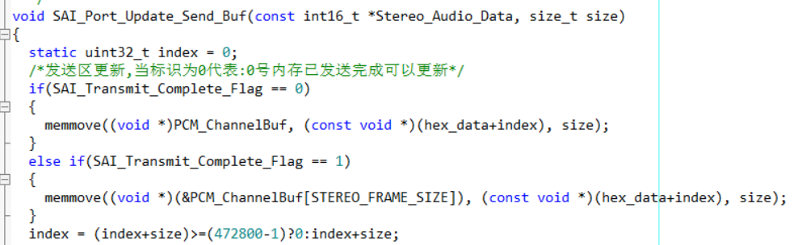
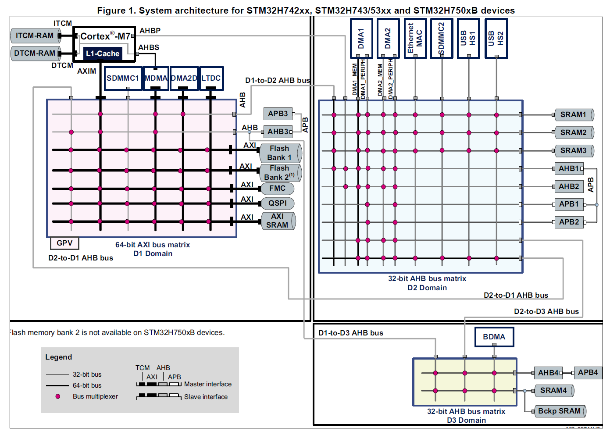
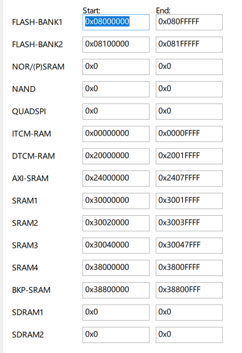
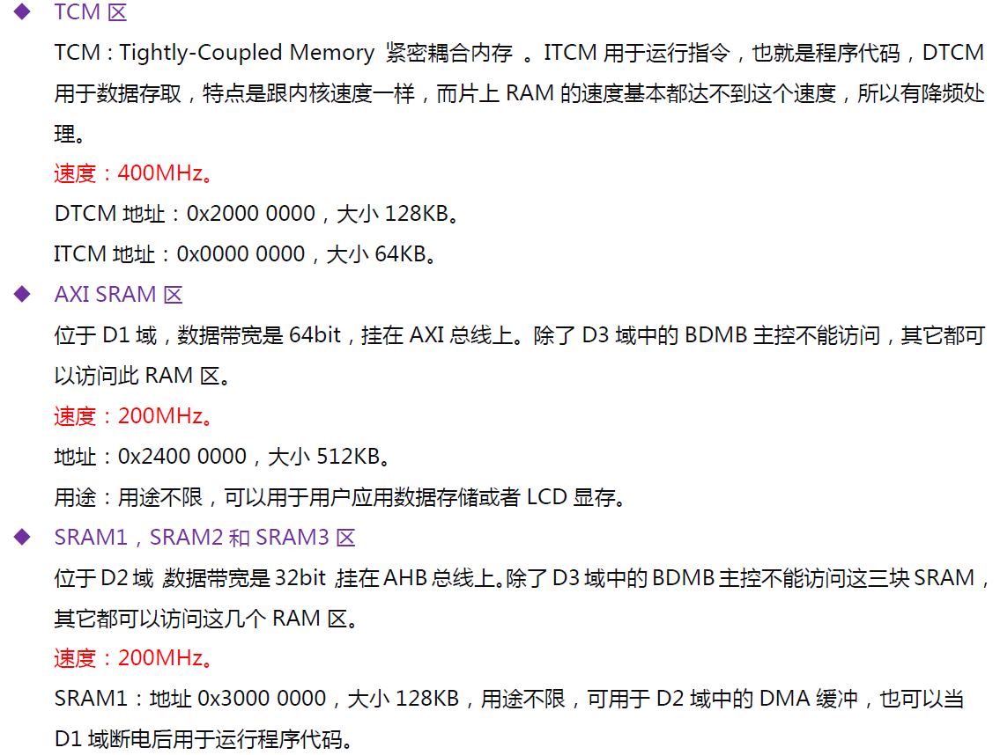
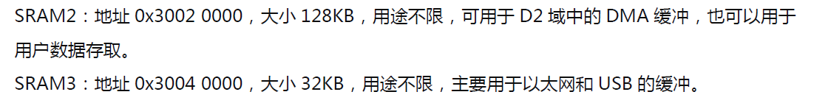
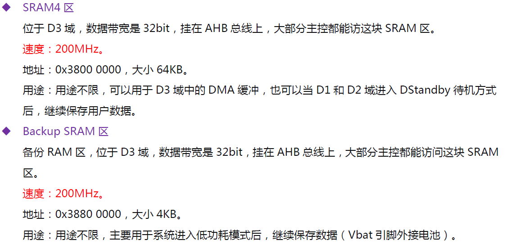

# STM32H743VIT6_Algorithm_DFSDM_4MIC

## 通讯协议

设备通讯协议主要实现对设备的控制和监视功能，如：验配功能（测听，参数调整）、维护功能（软件更新、提示音频更新）、功能启用（算法切换、参数调整、音量调整）。

详情见：[通讯协议](DOC/协议报文.md)

# 维护工具的使用说明

目前维护工具功能：

- 支持USB通讯（USB type-c直连），蓝牙通讯（串口转USB对接蓝牙设备），普通串口通讯（有线，仅用于注册）
- 支持提示音更新
- 支持固件升级
- 支持Bootloader升级
- 支持设备注册，读取设备UID
- 支持参数读取修改
- 支持测听功能
- 支持任意多通道曲线图表
- 支持电池充电图表

## 维护工具-设备注册


## 维护工具-设备监控调试

设备监控包含对设备的参数设置、读取、固件更新、固件上载，通讯接口以BLE-103蓝牙模块作为主机发起对从机蓝牙的连接。

软件打开后自动扫描可用串口列表，波特率设置为115200，无线方式。

**点击连接后等待约10s左右时间，软件扫描到可用蓝牙信号列表，选择其中一个进行连接（设备的蓝牙）。**

连接成功后再软件的标题栏会显示连接成功标识，并自动获取全部参数。


## 维护工具-固件升级

连接方法同-设备监控调试，不再累述。


## 维护工具-固件上载

连接方法同-设备监控调试，不再累述。


## 维护工具-文件传输

连接方法同-设备监控调试，不再累述。

目前文件传输，仅用于更新音频数据，支持上载和下载（更新）。


## 维护工具-提示音频更新

连接方法同-设备监控调试，不再赘述。

> 提示音频更新自版本v3.5开始支持wav文件直接更新，采样率限制在16Khz，支持双通道或单通道wav文件。


## 维护工具-电池充电图表

连接方法同-设备监控调试，不再累述。


## 调试-通用图表

由于通用图表的功能具有独立性，所以连接方式有别于以上，在主界面不进行连接，需进入通用图表界面（主界面->工具->曲线图表）进行连接。

使用方法：串口连接后发送字符串：

```
$通道1数值 通道2数值;

如：
$200 0;

通道数量不限制
```


## 调试-硬件错误追踪

当代码编写出现问题进入Hardfault时，串口输出堆栈信息，使用addr2line.exe工具进行调试快速定位错误代码处

工具位于：`DebugTool/addr2line.exe`

## 调试-音频数据转换工具

工具位于：`DebugTool/ffmpeg_tool`

### 将WAV文件转换为PCM数据

```bash
ffmpeg -i xxx.wav -f s16le -ar 16000 -ac 1 -acodec pcm_s16le pcm16k.pcm
```

其中：

- -f为存储类型
- s16le指的是16位整形数据
- le代表的是小端序，对应的是be大端序，一般默认是le小端序。如果搞错了，生成的pcm文件是一串噪音
- -ar 是音频采样率，一般有8k，16k等各种不同的采样率
- -ac： 通道数，1指单通道
- -acodec：生成文件格式，pcm_s16le指的是pcm文件，s16le对应前面**-f**部分

### 用ffmpeg播放pcm文件：

```bash
ffplay -ar 16000 -channels 1 -f s16le -i output.pcm
```

## 制作录音数据播放

制作流程：

1. 使用FFMPEG将WAV文件转为PCM文件
2. 使用读取PCM文件导出16进制数组
3. 在程序中定义这个常量数组
4. 调用接口输出数据

PCM数据导出数组工具：

```c
/** Includes -----------------------------------------------------------------*/
#include <stdint.h> /**< need definition of uint8_t */
#include <stddef.h> /**< need definition of NULL    */
#include <stdbool.h>/**< need definition of BOOL    */
#include <stdio.h>  /**< if need printf             */
#include <stdlib.h>
#include <string.h>
#include <errno.h>
/** Private includes ---------------------------------------------------------*/
#include <fcntl.h>
#include <unistd.h>
#include <ctype.h>
#include <sys/stat.h>
/** Private defines ----------------------------------------------------------*/
#ifndef OUT_FILE_NAME
	#define OUT_FILE_NAME "default.file"
#endif
/** Exported typedefines -----------------------------------------------------*/

/*文件打开权限*/
typedef enum
{
	READ_ONLY = 0,
	READ_WRITE_ONLY,
	WRITE_CREAT_CLEAR,
	READ_WRITE_CREAT_CLEAR,
	WRITE_APPEND_CREAT,
	READ_WRITE_APPEND_CREAT,
}FILE_OPEN_MODE;

/*文件分割方式*/
typedef enum
{
	SPACE_SPLIT = 0,
	COMMA_SPLIT,
}FILE_SPLIT_MODE;

/** Exported constants -------------------------------------------------------*/

/** Exported macros-----------------------------------------------------------*/
#define PRINT_ERRMSG(STR) fprintf(stderr,"line:%d,msg:%s,eMsg:%s\n", __LINE__, STR, strerror(errno))
/** Exported variables -------------------------------------------------------*/
/** Exported functions prototypes --------------------------------------------*/
/*返回指定文件是否存在*/
int file_is_exist(const char *fimename);

/*打开指定文件返回文件描述符*/
FILE *file_open(const char *filename ,FILE_OPEN_MODE mode);

/*读取指定打开的文件，返回总行数*/
int file_get_line_cnt(const char *filename);

/*获取文件大小*/
int get_file_size(const char *filename);

/*读取指定打开的文件指定行的内容到缓冲区*/
size_t file_read(const char *filename ,char *destbuf ,size_t size ,int linenum);

/*替换字符*/
size_t file_replace_ch(char *sourcebuf ,char sourcech,char destch);

/*清除字符串空格*/
char *strtriml(char *pstr);
char *strtrimr(char *pstr);
char *strtrim(char *pstr);

/*清除文本中空格，忽略注释标识行*/
bool file_strip_comments(char *string, char comment);
/**
  ******************************************************************
  * @brief   判断文件是否存在
  * @param   [in]fimename 文件名
  * @retval  返回0文件存在
  * @author  aron566
  * @version V1.0
  * @date    2020-08-28
  ******************************************************************
  */
int file_is_exist(const char *fimename)
{
	return access(fimename ,F_OK | W_OK | R_OK);
}

/**
  ******************************************************************
  * @brief   打开指定文件返回文件描述符,追加模式下fseek(fp, 0, SEEK_SET)无效
  * @param   [in]fimename 文件名
  * @param   [in]mode 打开文件的模式选择
  * @retval  返回0文件存在
  * @author  aron566
  * @version V1.0
  * @date    2020-08-28
  ******************************************************************
  */
FILE *file_open(const char *filename ,FILE_OPEN_MODE mode)
{
	FILE *fp = NULL;
	switch(mode)
	{
	case READ_ONLY:
		fp = fopen(filename ,"r");
		break;
	case READ_WRITE_ONLY:
		fp = fopen(filename ,"r+");
		break;
	case WRITE_CREAT_CLEAR:
		fp = fopen(filename ,"w");
		break;
	case READ_WRITE_CREAT_CLEAR:
		fp = fopen(filename ,"w+");
		break;
	case WRITE_APPEND_CREAT:
		fp = fopen(filename ,"a");
		break;
	case READ_WRITE_APPEND_CREAT:
		fp = fopen(filename ,"a+");/**< 首次读取时，从文件头部开始读*/
		break;
	}
	return fp;
}

/**
  ******************************************************************
  * @brief   打开读取指定打开的文件，返回总行数
  * @param   [in]fp 文件指针
  * @param   [in]filename 文件名称
  * @retval  返回-1读取失败
  * @author  aron566
  * @version V1.0
  * @date    2020-08-28
  ******************************************************************
  */
int file_get_line_cnt(const char *filename)
{
	int cnt = 0;
	char buf[256];
	FILE *fp = file_open(filename ,READ_ONLY);
	if(fp == NULL)
	{
		PRINT_ERRMSG("fopen");
		printf("read file name :%s error.\n" ,filename);
		return -1;
	}

	char *ret = NULL;
	/*读取文件流中的内容*/
	while((fgets(buf ,256 ,fp)) != NULL)
	{
		ret = strchr(buf ,'\n');
		if(ret != NULL)
		{
			cnt++;
		}
	}

	/*关闭文件*/
	fclose(fp);
	return cnt;
}

/**
  ******************************************************************
  * @brief   获取文件大小
  * @param   [in]fileName
  * @return  文件大小字节数
  * @author  aron566
  * @version V1.0
  * @date    2020-12-13
  ******************************************************************
  */
int get_file_size(const char *filename)
{ 
	struct stat st;
	stat(filename, &st);
	return st.st_size;
}


/**
  ******************************************************************
  * @brief   读取指定打开的文件指定行的内容到缓冲区
  * @param   [in]filename 文件名称
  * @param   [in]读取到的数据存储区
  * @param   [in]限制长度
  * @param 	 [in]需读取的行
  * @retval  执行结果，读取到字节数
  * @author  aron566
  * @version V1.0
  * @date    2020-08-28
  ******************************************************************
  */
size_t file_read(const char *filename ,char *destbuf ,size_t size ,int linenum)
{
	int cnt = 0;
	char buf[1024];

	/*初始化缓冲区*/
	if(strlen(destbuf) > 0)
	{
		destbuf[0] = '\0';
	}

	/*打开文件流*/
	FILE *fp = file_open(filename ,READ_ONLY);
	if(fp == NULL)
	{
		PRINT_ERRMSG("fopen");
		return -1;
	}

	/*读取文件流中的内容*/
	char *ret = NULL;
	size_t len = 0;
	while((fgets(buf ,1024 ,fp)) != NULL)
	{
		ret = strchr(buf ,'\n');
		if(ret != NULL)
		{
			cnt++;
			if(cnt == linenum)
			{
				if(len == 0)
				{
					strncpy(destbuf ,buf ,1024);
					if(size > 1024)
					{
						destbuf[1024] = '\0';
					}
					else
					{
						destbuf[1023] = '\0';
					}
				}
				else
				{
					/*追加字符串*/
					len += strlen(buf);
					if(len > size)
					{
						break;
					}
					else
					{
						strcat(destbuf ,buf);
					}
				}
				fclose(fp);
				return strlen(destbuf);
			}//cnt == linenum
		}
		else
		{
			/*判断是否超出缓冲区大小*/
			if(cnt == linenum-1)
			{
				/*目标缓冲区过小直接退出*/
				if(size <= 1024)
				{
					break;
				}
				len = strlen(destbuf);
				if(len == 0)
				{
					strncpy(destbuf ,buf ,1024);
					destbuf[1024] = '\0';
				}
				else
				{
					/*追加字符串*/
					len += strlen(buf);
					if(len > size)
					{
						break;
					}
					else
					{
						strcat(destbuf ,buf);
					}
				}
			}
		}
	}
	fclose(fp);
	return strlen(destbuf);
}

/**
  ******************************************************************
  * @brief   写入指定的内容到文件
  * @param   [in]filename 文件名称
  * @param   [in]buffer数据存储区
  * @param   [in]size写入的元素占总字节数
  * @param 	 [in]count写入元素数目
  * @param 	 [in]mode文件写入模式
  * @retval  执行结果，写入元素的总数
  * @author  aron566
  * @version V1.0
  * @date    2020-10-09
  ******************************************************************
  */
size_t file_write(const char *filename ,const void* buffer ,size_t size ,size_t count ,FILE_OPEN_MODE mode)
{
	/*打开文件流*/
	FILE *fp = file_open(filename ,mode);
	if(fp == NULL)
	{
		return 0;
	}
	size_t cnt = fwrite(buffer ,size ,count ,fp);
	/*同步到文件中*/
	fflush(fp);
	fclose(fp);
	return cnt;
}

/**
  ******************************************************************
  * @brief   替换目标字符串中字符
  * @param   [in]目标字符串
  * @param   [in]源字符
  * @param   [in]目标字符
  * @retval  执行结果，当前字符长度
  * @author  aron566
  * @version V1.0
  * @date    2020-08-28
  ******************************************************************
  */
size_t file_replace_ch(char *sourcebuf ,char sourcech,char destch)
{
    int i;
    i = strlen(sourcebuf) - 1;
    while (sourcebuf[i] == sourcech && (i >= 0))
    	sourcebuf[i--] = destch;
    return strlen(sourcebuf);
}

/**
  ******************************************************************
  * @brief   去除字符串右端空格
  * @param   [in]字符串指针
  * @retval  修剪后的字符串地址
  * @author  aron566
  * @version V1.0
  * @date    2020-08-28
  ******************************************************************
  */
char *strtrimr(char *pstr)
{
    int i;
    i = strlen(pstr) - 1;
    while (isspace(pstr[i]) && (i >= 0))
        pstr[i--] = '\0';
    return pstr;
}

/**
  ******************************************************************
  * @brief   去除字符串左端空格
  * @param   [in]字符串指针
  * @retval  修剪后的字符串地址
  * @author  aron566
  * @version V1.0
  * @date    2020-08-28
  ******************************************************************
  */
char *strtriml(char *pstr)
{
    int i = 0,j;
    j = strlen(pstr) - 1;
    while (isspace(pstr[i]) && (i <= j))
        i++;
    if (0<i)
        strcpy(pstr, &pstr[i]);
    return pstr;
}

/**
  ******************************************************************
  * @brief   去除字符串两端空格
  * @param   [in]字符串指针
  * @retval  修剪后的字符串地址
  * @author  aron566
  * @version V1.0
  * @date    2020-08-28
  ******************************************************************
  */
char *strtrim(char *pstr)
{
    char *p;
    p = strtrimr(pstr);
    return strtriml(p);
}

/**
  ******************************************************************
  * @brief   去掉字符串内所有空白，且忽略注释部分，最终得到没有空白的字符串
  * @param   [in]string：字符串
  * @param   [in]comment：注释标识
  * @retval  true表示数据可用
  * @author  aron566
  * @version V1.0
  * @date    2020-08-31
  ******************************************************************
  */
bool file_strip_comments(char *string, char comment)
{
  if (NULL == string || '\n' == *string || '\r' == *string) {
    return false; /* 第一个字符为回车或换行,表示空行 */
  }

  char *p, *q;
  /* 下面去掉字符串中所有空白字符 */
  for (p = q = string; *p != '\0' && *p != comment; p++) {
	  /* 不是空白字符则重写字符串 */
    if (0 == isspace(*p)) {
      *q++ = *p;
    }
  }
  *q = '\0';

  return 0 != strlen(string); /* 字符串长度不为0,表示数据可用 */
}

/**
 * @brief 16进制字符转为数值
 * 
 * @param ch 16进制字符
 * @return uint8_t 数值
 */
uint8_t hex_char_to_value(uint8_t ch)
{
	uint8_t result = 0;
	/*获取16进制的高字节位数据*/
	if (ch >= '0' && ch <= '9')
	{
		result = ch - '0';
	}
	else if (ch >= 'a' && ch <= 'z')
	{
		result = ch - 'a' + 10;
	}
	else if (ch >= 'A' && ch <= 'Z')
	{
		result = ch - 'A' + 10;
	}
	else
	{
		result = 0;
	}
	return result;
}

/**
 * @brief 将大写字母转换成小写字母
 * 
 * @param ch 大写字母
 * @return uint8_t 小写字母
 */
uint8_t ch_tolower(uint8_t ch)
{
    if(ch >= 'A' && ch <= 'Z')
    {
        return ch + 'a' - 'A';
    }
    else
    {
        return ch;
    }
}

/**
 * @brief 16进制的字符串转换成整数
 * 
 * @param s 16进制字符串
 * @return int 数值
 */
int hextoi(char s[])
{
    int i = 0;
    int ret = 0;
    if(s[0] == '0' && (s[1]=='x' || s[1]=='X'))
    {  
        i = 2;
    }
    else
    {
        i = 0;
    }
    for(;(s[i] >= '0' && s[i] <= '9') || (s[i] >= 'a' && s[i] <= 'z') || (s[i] >='A' && s[i] <= 'Z');++i)
    {
        if(ch_tolower(s[i]) > '9')
        {
            ret = 16 * ret + (10 + ch_tolower(s[i]) - 'a');
        }
        else
        {
            ret = 16 * ret + (ch_tolower(s[i]) - '0');
        }
    }
    return ret;
}

/**
 * @brief main入口
 * 
 * @param argc 参数个数
 * @return argv[] 参数
 */
int main(int argc ,char *argv[])
{
#if defined (ENABLE_PRINTF_HEX)
	if(argc < 2)
	{
		printf("Usage:%s filename\n" ,argv[0]);
		return -1;
	}
#else
	if(argc < 4)
	{
		printf("Usage:%s filename strlen split_num\n" ,argv[0]);
		return -1;
	}

	int buf_len = atoi(argv[2]);
	char *strbuf = (char*)malloc(sizeof(char)*buf_len);
	if(strbuf == NULL)
	{
		printf("malloc error！\n");
		return -1;
	}
	memset(strbuf ,0 ,buf_len);
#endif

	/*打开文件*/
	FILE *fp = file_open(argv[1] ,READ_ONLY);
	if(fp == NULL)
	{
		printf("can't open file.\n");
		return -1;
	}
#if defined (ENABLE_PRINTF_HEX)
	/*获取文件字节数*/
	int file_size = get_file_size(argv[1]);
	uint8_t byte = 0;
	char hex_str[64];
	sprintf(hex_str, "static const uint8_t hex_data[%d] = \n{\n", file_size);
	file_write("hex_file.txt" ,hex_str ,1 ,strlen(hex_str) ,WRITE_APPEND_CREAT);
  for(int index = 0; index < file_size; index++)
	{
		fread(&byte, 1, 1, fp);
		if(index == file_size-1)
		{
			sprintf(hex_str, "0x%02X", byte);
		}
		else
		{
			sprintf(hex_str, "0x%02X, ", byte);
		}
    if((index % 20) == 0)
    {
      strcat(hex_str, "\n");
    }
		file_write("hex_file.txt" ,hex_str ,1 ,strlen(hex_str) ,WRITE_APPEND_CREAT);
	}
	sprintf(hex_str, "\n};\n");
	file_write("hex_file.txt" ,hex_str ,1 ,strlen(hex_str) ,WRITE_APPEND_CREAT);
	return 0;
#else
	/*读取文件内容*/
	char txt[64] = {0};
	while((fgets(txt ,64 ,fp)) != NULL)
   {
	    /* 去掉字符串所有空白,注释也忽略 */
	    if (file_strip_comments(txt ,' '))
	    {
	      strcat(strbuf ,txt);
	    }
   }
	
	int split_num = atoi(argv[3]);
	uint8_t temp = 0;
	for(int i = 0;i < buf_len;)
	{
#if defined (ENABLE_PRINTF_CH)
		if(i < split_num)
		{
			printf("%c%c" ,strbuf[i] ,strbuf[i+1]);
		}
		else
		{
			printf(" ""%c%c" ,strbuf[i] ,strbuf[i+1]);
		}
#endif
#if defined (ENABLE_OUT_FILE)
		temp = hex_char_to_value(strbuf[i]);
		temp <<= 4;
		temp |= hex_char_to_value(strbuf[i+1]);
		file_write(OUT_FILE_NAME ,&temp ,1 ,1 ,WRITE_APPEND_CREAT);
#endif
		i += split_num;
	}
#endif
	return 0;
}
```

以上代码保存为`cov.c`

linux平台下直接编译：

已编译好的工具位于：`DebugTool/cov_tool`

```bash
#编译
gcc cov.c -DENABLE_PRINTF_HEX -o cov_tool
#添加执行权限
sudo chmod +x cov_tool

#执行转换
./cov_tool <pcm文件名>

#输出
hex_file.txt
```

复制`hex_file.txt`中文本，在程序中定义音频常量



DMA循环自动发送数据，所以我们拷贝数据即可



# 设备操作

设备具有的功能：

- 电量计量(MX17048)
- 低功耗蓝牙与手机App通讯（有人模块）
- 3轴加速度传感器+3轴陀螺仪传感器（MPU6050）
- 外部8MB的存储空间，支持参数存储，提示音更新（GD）
- BF+RNN+EMD（分左右耳&5通道调节）&WOLA（分左右耳&16通道调节）+WDRC+VOL+AGC算法
- USB-Type-c 高速通讯（与PC软件）
- 4通道MIC阵列
- 耳机插入检测，自动省电休眠，重新插入自动2秒内唤醒，支持按键强制休眠与唤醒

## 按键功能

1. 电源管理按键
2. 降噪调节按键
3. 音量增按键
4. 音量减按键

### 电源管理按键

设备运行态：

- 单击 - 除电源按键外，其他按键皆不可触发（上锁功能）
- 双击 - 所有按键皆可触发（解锁）
- 长按 - 进入低功耗模式 （设备停止运行）

设备低功耗模式：

- 单击 - 恢复运行态

### 降噪调节按键

设备运行态：

- 单击 - 三档切换，最大值：100，最小值：0，中间值：70
- 双击 - 退出线性补偿模式
- 长按 - 进入线性补偿模式

### 音量增按键

设备运行态：

- 单击 - 提高音量等级（+1）最大值：5

线性补偿：

- 单击 - 调节线性补偿（待开发）

### 音量减按键

设备运行态：

- 单击 - 降低音量等级（-1）最小值：0

线性补偿：

- 单击 - 调节线性补偿（待开发）

# 接口说明

STM32H1743VIT6主要依赖CubeMX生成初始化代码，在此基础上添加产品所需的功能业务代码，因此后续的编码都应注意对底层接口与应用层接口的分离。

如：**DAC_Port.c** 就是对DAC底层驱动的封装，提供其他应用层对DAC的操作接口，如：更新DAC输出数据、调节DAC增益、调节DAC采样率、输出指定数据等。

设备初始化，位于main.c中调用

```c
/**
  ******************************************************************
  * @brief   初始化各模块功能
  * @param   [in]None
  * @return  None.
  * @author  aron566
  * @version V1.0
  * @date    2021-02-25
  ******************************************************************
  */
void User_Main_Task_Init(void)
{
  /*错误追踪初始化*/
  CM_Backtrace_Port_Init();

  /*串口操作初始化*/
  Uart_Port_Init();

  /*Flash接口初始化*/
  Flash_Port_Init();

  /*定时器初始化*/
  Timer_Port_Init();
  
  /*协议栈初始化*/
  Protocol_Stack_Init();

  /*算法接口初始化*/
  Algorithm_Port_Init();

  /*参数接口初始化*/
  Parameter_Port_Init();
  
  /*电量计初始化*/
  Voltameter_Port_Init();

  /*陀螺仪初始化*/
  Gyroscope_Port_Init();
  
  /*蓝牙接口初始化*/
  Bluetooth_Port_Init();
   
  /*按键检测初始化*/
  PressKey_Port_Init();
  
  /*DAC初始化*/
  DAC_Port_Init();
  
  /*SAI初始化*/
  SAI_Port_Init();

  /*other initialization task code*/
}
```

设备任务处理循环，位于main.c中调用

```c
/**
  ******************************************************************
  * @brief   任务处理循环
  * @param   [in]None
  * @return  None.
  * @author  aron566
  * @version V1.0
  * @date    2021-02-25
  ******************************************************************
  */
void User_Main_Task_Process_Loop(void)
{
  for(;;)
  {
    /*启动协议栈*/
    Protocol_Stack_Start();
    
    /*启动SAI*/
    SAI_Port_Start();
    
    /*定时器模块启动*/
    Timer_Port_Start();
  }
  /*never return*/
}
```

## 各主要接口文件的功能

| 接口文件名               | 功能含义                                                     |
| ------------------------ | ------------------------------------------------------------ |
| Flash_Port.c             | 对外提供Flash操作接口                                        |
| LED_Port.c               | 对外提供LED操作接口                                          |
| Timer_Port.c             | 对外提供运行时间、定时任务的初始化与启动接口                 |
| UART_Port.c              | 对外提供串口操作接口、USB CDC数据传输接口                    |
| Algorithm_Port.c         | 对外提供算法操作接口，各算法的初始化、执行调用、切换等       |
| Update_Port.c            | 对外提供固件升级操作接口                                     |
| Parameter_Port.c         | 对外提供参数存储接口                                         |
| Bluetooth_Port.c         | 对外提供蓝牙模块的启动配置、休眠、唤醒接口                   |
| Voltameter_Port.c        | 对外提供电量计的配置及数据读取接口                           |
| SAI_Port.c               | 对外提供音频传输的初始化配置、静音控制、采样率切换接口、启停接口 |
| Gyroscope_Port.c         | 对外提供陀螺仪的初始化配置、读取接口                         |
| PressKey_Port.c          | 对外提供按键配置、按键业务逻辑接口                           |
| Power_Management_Port.c  | 对外提供设备重启、停机休眠接口                               |
| DAC_Port.c               | 对外提供DAC初始化配置接口、增益调节、采样率修改等接口、还包含测听数据的生成接口 |
| Tips_Audio_Port.c        | 对外提供提示音数据                                           |
| Update_Protocol.c        | 固件升级协议的实现，BL/APP/FACTORY更新等协议功能的实现       |
| File_Transfer_Protocol.c | 文件传输协议的实现、主要用于提示音更新                       |
| Main_Protocol.c          | 验配协议的实现、附带启动其他协议的启动配置                   |
| MAX17048_Driver.c        | 电量计的驱动                                                 |
| MPU6050_Driver.c         | 陀螺仪的驱动                                                 |
| WM8978_Driver.c          | DAC的驱动                                                    |
|                          |                                                              |


## 设备运行流程

- 第一个阶段，初始化阶段
  - 初始化通讯接口
  - 读取存储的参数
  - 初始化外部硬件
  - 配置蓝牙
  - 配置周期任务及延时任务
- 第二个阶段，正常运行
  - 默认启用全部算法处理音频数据，BF角度270°

  - 协议栈运行（接收来自蓝牙的数据，进入特定模式，执行特定任务）

    - 特定模式：文件传输模式，进入文件传输模式后，设备将停止音频处理，直至文件传输结束或者超时10s自动恢复正常状态

      ​				  固件升级模式

    - 特定任务：测听任务

  - 定时任务运行（按键检测，电量读取，陀螺仪数据）

## 编程注意事项

### 外设与内存区域访问限制





### 优化加速区域







